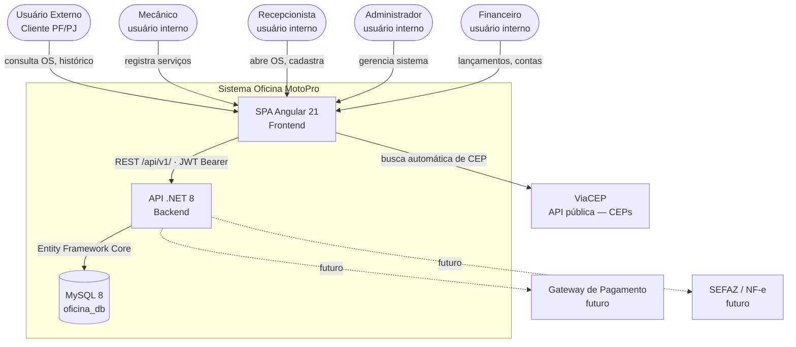
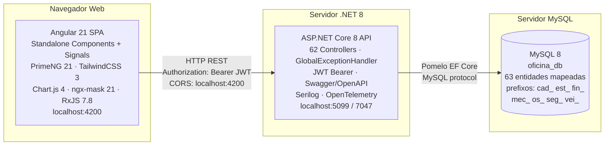
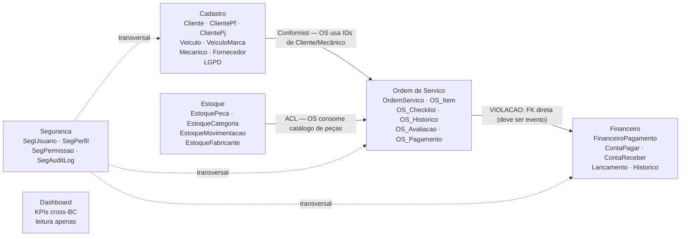
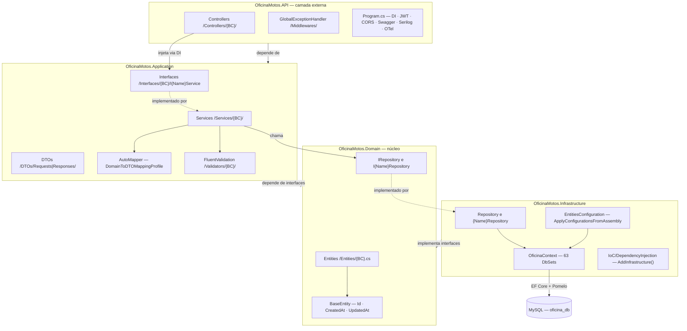
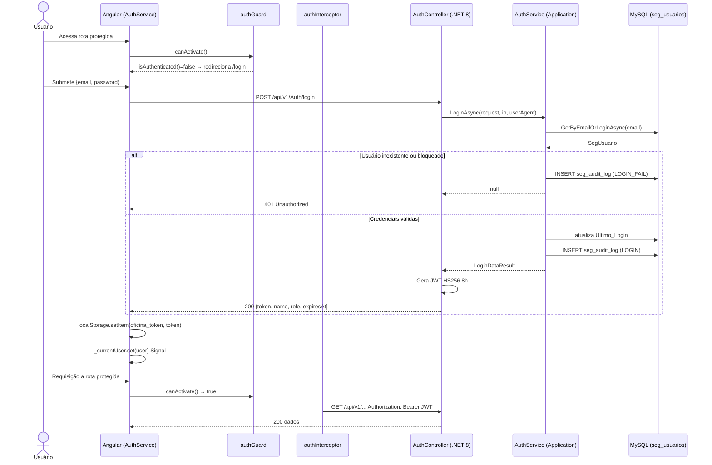

# Arquitetura — Oficina MotoPro

> **Última atualização:** 2026-07-18
> **Fonte:** Análise direta do código — `oficina-motos-api/`, `oficina-motos-web/`, `oficina-motos-docs/`

---

## 1. Visão Geral do Stack

| Camada | Tecnologia | Versão | Arquivo de referência |
|---|---|---|---|
| Backend | ASP.NET Core | 8.0.x | `OficinaMotos.API.csproj` |
| ORM | Entity Framework Core + Pomelo (MySQL) | 8.0.3 | `OficinaMotos.API.csproj` |
| Banco de dados | MySQL | 8+ | `appsettings.json` |
| Frontend | Angular | 21.0.0 | `package.json` |
| UI components | PrimeNG | 21.0.1 | `package.json` |
| CSS utilitário | TailwindCSS | 3.4.14 | `tailwind.config.js` |
| Gráficos | Chart.js | 4.5.1 | `package.json` |
| Máscaras | ngx-mask | 21.0.1 | `package.json` |
| Reatividade | RxJS | 7.8.0 | `package.json` |
| Autenticação | JWT Bearer HS256 | — | `Program.cs` |
| Logs | Serilog | 8.0.3 | `OficinaMotos.API.csproj` |
| Observabilidade | OpenTelemetry | 1.14.0 | `OficinaMotos.API.csproj` |
| Mapeamento | AutoMapper | — | `Application/IoC` |
| Validação | FluentValidation | — | `Application/IoC` |

### Estrutura de pastas de alto nível

```
c:\Projetos\OficinaMotos\
├── governance/                        ← documentação de governança
├── oficina-motos-api/                 ← solução .NET 8
│   └── src/
│       ├── OficinaMotos.API/          ← controllers, middlewares, Program.cs
│       ├── OficinaMotos.Application/  ← services, DTOs, mappings, validators
│       ├── OficinaMotos.Domain/       ← entities, interfaces
│       └── OficinaMotos.Infrastructure/ ← repositories, EF Context, IoC
├── oficina-motos-docs/                ← documentação técnica e SQL scripts
└── oficina-motos-web/                 ← SPA Angular 21
    └── src/app/
        ├── core/                      ← auth, interceptors, services globais
        ├── features/                  ← módulos de negócio por BC
        ├── layout/                    ← header, sidebar, footer, main-layout
        └── shared/                    ← UI reutilizável, validators, services
```

---

## 2. Diagrama C4 — Nível 1: Contexto do Sistema



---

## 3. Diagrama C4 — Nível 2: Containers



---

## 4. Bounded Contexts e Context Map

O sistema possui **8 bounded contexts** agrupados sob um único monólito modular.



### Distribuição das entidades por Bounded Context

| BC | Prefixo tabela | Total entidades |
|---|---|:---:|
| Clientes | `cad_clientes*` | 11 |
| Estoque | `est_` | 8 |
| Financeiro | `fin_` | 7 |
| Fornecedores | `cad_fornecedores*` | 10 |
| Mecânicos | `cad_mecanicos*` | 9 |
| Ordem de Serviço | `os_` | 8 |
| Veículos | `cad_veiculos*` | 3 |
| Segurança | `seg_` | 7 |
| **Total** | | **63** |

> Todos os 63 DbSets residem no único `OficinaContext` em `Infrastructure/Context/OficinaContext.cs`.

---

## 5. Clean Architecture — Fluxo entre Camadas



**Regra de dependência:** `API → Application → Domain ← Infrastructure`

### Convenção de IoC

| Tipo | Vida útil |
|---|---|
| `IRepository<T>` / repositórios específicos | Scoped |
| `I{Nome}Service` / services | Scoped |
| `AutoMapper` (perfil único) | Singleton |
| `OficinaContext` | Scoped |

---

## 6. Estrutura da API — Controllers por Bounded Context

**Padrão de rota:** `api/v1/{ControllerName}`

| BC | Total Controllers | `[Authorize]` |
|---|:---:|:---:|
| Auth | 1 | — (login público) |
| Clientes | 11 | ❌ |
| Veículos | 3 | ❌ |
| Mecânicos | 9 | ❌ |
| Fornecedores | 10 | ❌ |
| Ordens de Serviço | 8 | ❌ |
| Estoque | 8 | ❌ |
| Financeiro | 7 | ❌ |
| Segurança | 5 | ✅ |
| **Total** | **62** | **5 protegidos / 57 abertos** |

---

## 7. Estrutura do Frontend — Angular 21

### `core/` — Infraestrutura global

| Arquivo | Responsabilidade |
|---|---|
| `auth/auth.service.ts` | Estado via `signal<CurrentUser \| null>`; login/logout; token em `localStorage` |
| `auth/auth.guard.ts` | `CanActivateFn` — redireciona para `/login` se não autenticado |
| `auth/auth.interceptor.ts` | Injeta `Authorization: Bearer {token}`; controla loading global |
| `interceptors/error-interceptor.ts` | Trata erros HTTP (401 → logout, 403/500 → toast) |
| `services/api-paths.ts` | Mapa centralizado de todos os endpoints |
| `services/api-client.service.ts` | Cliente HTTP base |
| `services/{bc}.service.ts` | Services tipados por BC |
| `models/` | Interfaces de domínio compartilhadas |

### `features/` — Módulos de negócio

| Feature | Rota Angular | Status atual |
|---|---|---|
| `auth/` | `/login` | Implementado |
| `dashboard/` | `/dashboard` | Parcial — dados mockados |
| `clientes/` | `/clientes` | Parcial — 4 páginas |
| `motos/` | `/motos` | Parcial — lista + detalhe |
| `estoque/` | `/estoque` | Lista apenas |
| `fornecedores/` | `/fornecedores` | Lista + detalhe |
| `mecanicos/` | `/mecanicos` | Lista (detalhe sem rota) |
| `ordens-servico/` | `/ordens` | Componente de detalhe age como lista |
| `financeiro/` | `/financeiro` | Dashboard básico com mocks |

### `shared/` — Componentes e serviços reutilizáveis

| Caminho | O que fornece |
|---|---|
| `shared/services/toast.ts` | Notificações globais (PrimeNG Toast) |
| `shared/services/loading.ts` | Loading overlay global |
| `shared/services/confirmation.ts` | Dialog de confirmação |
| `shared/services/cep.ts` | Integração ViaCEP |
| `shared/ui/data-table/` | Tabela genérica com paginação, ordenação, filtros |
| `shared/ui/file-upload/` | Upload de arquivos |
| `shared/validators/` | Validators: CPF, CNPJ, e-mail, telefone, CEP |
| `shared/constants/masks.ts` | Máscaras ngx-mask (CPF, CNPJ, telefone, CEP, placa, RENAVAM) |

---

## 8. Fluxo de Autenticação JWT



**Parâmetros do token JWT:**

| Parâmetro | Valor |
|---|---|
| Algoritmo | HS256 |
| Expiração | 8 horas |
| Claims | `sub` · `email` · `unique_name` · `name` · `jti` · `role[]` · `permissao[]` |

---

## 9. Modelo de Segurança RBAC

### Hierarquia de Perfis

| Nível | Perfil | Descrição |
|---|---|---|
| 1 | Administrador | 46 permissões — acesso total |
| 2 | Gerente | Quase total — exceto criar/editar usuários |
| 3 | Recepcionista | Dashboard · Clientes CRUD · OS criar/editar · Veículos |
| 4 | Financeiro | Dashboard · OS ver · Financeiro completo · Relatórios |
| 5 | Mecânico | Dashboard · Veículos/Clientes ver · OS ver/editar/aprovar · Estoque ver/editar |
| 6 | Consulta | Somente visualizar — sem Segurança e Configurações |

### Cadeia das tabelas de segurança

```
seg_modulos (11 módulos)
    └── seg_permissoes (46 permissões = módulo × ação)
            └── seg_perfis_permissoes (128 vínculos)
                    └── seg_perfis (6 perfis)
                            └── seg_usuarios_perfis (N:N)
                                    └── seg_usuarios (bcrypt custo 12)
                                            └── seg_audit_log (INSERT-ONLY)
```

---

## 10. Decisões de Arquitetura (ADRs)

### ADR-001 — Clean Architecture com 4 projetos separados

**Status:** Implementado
**Decisão:** Separar em 4 projetos respeitando `API → Application → Domain ← Infrastructure`.
**Benefícios:** Isolamento de frameworks; testabilidade sem dependência de ASP.NET ou EF Core.
**Custo:** Boilerplate — cada entidade exige ~3-4 arquivos (interface repo + implementação + registro IoC + service).

---

### ADR-002 — Único DbContext para todos os Bounded Contexts

**Status:** Implementado (débito arquitetural reconhecido — DA-002)
**Decisão:** Um único `OficinaContext` com 63 `DbSet<T>`.
**Benefícios:** Simplicidade — um schema, migrações centralizadas, joins SQL cross-BC.
**Custo:** Viola o isolamento de BCs. Impede deploy independente por contexto.

---

### ADR-003 — JWT gerado no Controller

**Status:** Implementado
**Decisão:** `AuthService` valida credenciais; serialização do JWT ocorre no `AuthController`.
**Custo:** Controller contém lógica não trivial. Candidato a extração em `ITokenService`.

---

### ADR-004 — Repositório Genérico + Repositórios Especializados

**Status:** Implementado
**Decisão:** `IRepository<T>` fornece CRUD básico; repositórios especializados adicionam queries específicas.
**Custo:** `GetAllAsync()` sem filtros pode retornar tabelas inteiras em produção.

---

### ADR-005 — Angular Signals para estado de autenticação

**Status:** Implementado
**Decisão:** `AuthService` usa `signal<CurrentUser | null>` + `computed(() => isAuthenticated)`.
**Benefícios:** Reatividade sem subscriptions. Compatível com OnPush.

---

### ADR-006 — `api-paths.ts` como registro centralizado de endpoints

**Status:** Implementado e respeitado
**Benefícios:** Mudança de URL propagada em um único arquivo; auditoria simples.

---

### ADR-007 — Observabilidade desde o desenvolvimento

**Status:** Implementado
**Stack:** Serilog (Console · Seq · Elasticsearch) + OpenTelemetry (Prometheus · OTLP/Jaeger)
**Instrumentações:** EF Core queries monitoradas via `AddEntityFrameworkCoreInstrumentation()`

---

## 11. Débitos Arquiteturais

### DA-001 — CRÍTICO: 57 controllers sem `[Authorize]`

**Tipo:** OWASP A01: Broken Access Control
**Impacto:** Qualquer pessoa com acesso à rede pode ler, criar, editar e excluir dados sem autenticação.

**Evidência:**
```csharp
// ClientesController.cs linha 11
// [Authorize] // Descomente para exigir Login (JWT) em todos os métodos
```

**Correção recomendada — 1 bloco no `Program.cs`:**
```csharp
builder.Services.AddAuthorization(options => {
    options.FallbackPolicy = new AuthorizationPolicyBuilder()
        .RequireAuthenticatedUser()
        .Build();
});
```
Mais `[AllowAnonymous]` no `AuthController.Login`.

---

### DA-002 — MÉDIO: `FinanceiroPagamento` viola isolamento de BC

**Tipo:** Violação de DDD / acoplamento entre BCs
**Evidência:**
```csharp
public class FinanceiroPagamento : BaseEntity {
    public OrdemServico? OrdemServico { get; set; }  // FK para BC OrdemServico
    public Cliente? Cliente { get; set; }            // FK para BC Cadastro
    public Fornecedor? Fornecedor { get; set; }      // FK para BC Cadastro
}
```
**Correção:** Introduzir ACL — substituir navegações por IDs externos e resolver via evento de domínio.

---

### DA-003 — MÉDIO: Chave JWT em `appsettings.json`

**Tipo:** OWASP A02: Cryptographic Failures
**Evidência:** `"Jwt": { "Key": "chave_super_secreta_oficina_motos_2026_troque_em_producao" }`
**Correção:** `dotnet user-secrets` (dev) ou Azure Key Vault / AWS Secrets Manager (produção).

---

### DA-004 — MÉDIO: JWT sem validação de Issuer/Audience

**Evidência:** `ValidateIssuer = false · ValidateAudience = false · RequireHttpsMetadata = false`
**Correção:** Configurar `ValidIssuer` e `ValidAudience`; `RequireHttpsMetadata = true` fora de dev.

---

### DA-005 — MÉDIO: Token JWT em `localStorage`

**Tipo:** OWASP A03 — XSS pode roubar o token
**Correção:** Migrar para `HttpOnly` cookies — backend retorna `Set-Cookie`; Angular usa `withCredentials: true`.

---

### DA-006 — BAIXO: Rotas Angular sem lazy loading

**Impacto:** Bundle inicial aumentado.
**Correção:** `loadComponent: () => import('./features/clientes/...').then(m => m.ClienteLista)`

---

### DA-007 — BAIXO: CORS hardcoded para `localhost:4200`

**Evidência:** `policy.WithOrigins("http://localhost:4200")` em `Program.cs`
**Correção:** Ler origens de `appsettings.json → Cors:AllowedOrigins[]`.

---

## 12. Padrões de Nomenclatura

### Backend (.NET 8)

| Artefato | Padrão | Exemplo |
|---|---|---|
| Entidades de domínio | PascalCase prefixado pelo BC | `Cliente`, `EstoquePeca`, `FinanceiroPagamento` |
| Entidades de segurança | `Seg` + nome | `SegUsuario`, `SegPerfil` |
| Interfaces de repositório | `I{Nome}Repository` | `IClienteRepository` |
| Implementações de repositório | `{Nome}Repository` | `ClienteRepository` |
| Interfaces de service | `I{Nome}Service` | `IClienteService` |
| Implementações de service | `{Nome}Service` | `ClienteService` |
| Controllers | `{Entidades}Controller` plural | `ClientesController` |
| DTOs de entrada | `{Acao}{Nome}DTO` | `CreateClienteDTO` |
| DTOs de saída | `{Nome}ResponseDTO` | `ClienteResponseDTO` |
| Rota base | `/api/v1/{ControllerName}` | `/api/v1/Clientes` |
| Tabelas do banco | `{prefixo}_{nome}` snake_case | `cad_clientes`, `seg_usuarios` |
| `BaseEntity` | `long Id · DateTime CreatedAt · DateTime? UpdatedAt` | — |

### Frontend (Angular 21)

| Artefato | Padrão | Exemplo |
|---|---|---|
| Componentes | PascalCase standalone | `ClienteLista`, `OsDetalhe` |
| Services | `kebab-case.service.ts` | `auth.service.ts` → `AuthService` |
| Guards | `{nome}.guard.ts` · export `camelCase: CanActivateFn` | `authGuard` |
| Interceptors | `{nome}.interceptor.ts` · export `camelCase: HttpInterceptorFn` | `authInterceptor` |
| Rotas de feature | `kebab-case` | `/clientes`, `/ordens-servico` |
| Signals privados | `_camelCase` | `_currentUser = signal<CurrentUser \| null>(...)` |
| Endpoints centralizados | `apiPaths.{bc}.{operacao}` | `apiPaths.clientes.base` |

---

*Documento gerado pela análise do código-fonte em 2026-07-18.*
