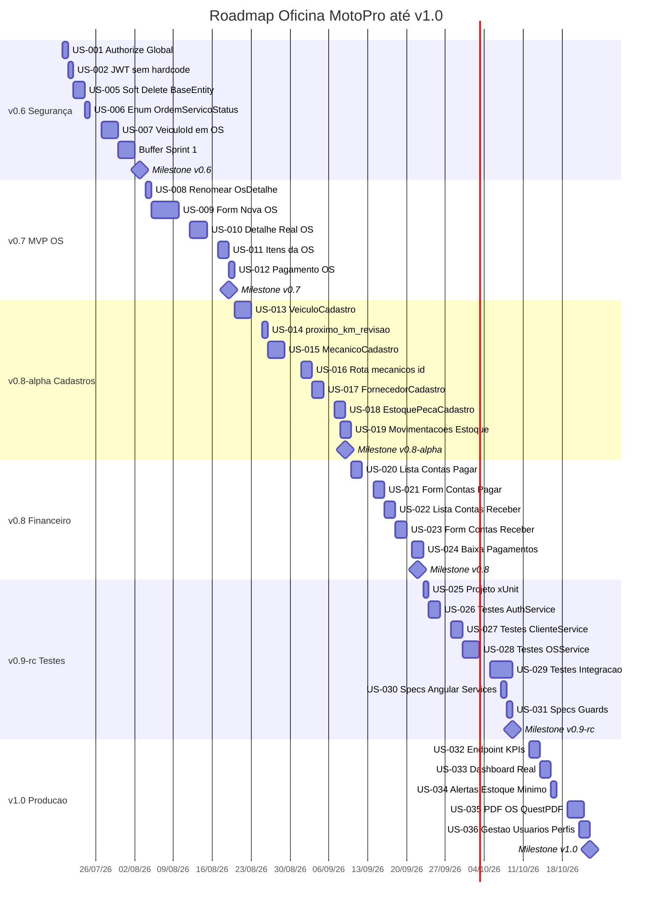

# Roadmap — Oficina MotoPro

**Gerado em:** 2026-07-18
**Versão do Roadmap:** 1.0
**Horizonte:** v0.5 (atual) → v1.0 (produção)

---

## 1. Resumo Executivo

O projeto **Oficina MotoPro** está **~53% concluído** na data de referência (2026-07-18).

- Backend (.NET 8): **~72%** — 62 controllers implementados, 56 sem `[Authorize]` (OWASP A01)
- Frontend (Angular 21): **~48%** — infraestrutura shared completa, formulários de CRUD ausentes
- Cobertura de testes: **~2%** (0 projetos xUnit, 2 specs triviais Angular)

O caminho até **v1.0 em produção** compreende **6 sprints / 72 dias úteis**, com entrega estimada para **2026-10-23**.

### Marcos Principais

| Marco | Versão | Data Estimada | Critério |
|-------|--------|--------------|----------|
| Segurança Corrigida | v0.6 | 2026-08-03 | OWASP A01+A02 fechados, JWT seguro |
| MVP OS Funcional | v0.7 | 2026-08-19 | Criar/editar OS com itens e pagamento |
| Cadastros Completos | v0.8-alpha | 2026-09-09 | Todos os formulários de CRUD implementados |
| Financeiro Operacional | v0.8 | 2026-09-22 | Contas a pagar/receber + baixa funcionais |
| Release Candidate | v0.9-rc | 2026-10-09 | Cobertura >= 70%, CI verde |
| **Produção** | **v1.0** | **2026-10-23** | Dashboard real, PDF OS, deploy validado |

---

## 2. Cronograma por Sprint

| Sprint | Período | Dias Úteis | Versão Resultante |
|--------|---------|-----------|------------------|
| Sprint 1 — Segurança | 2026-07-20 → 2026-08-03 | 11d | v0.6 |
| Sprint 2 — MVP OS | 2026-08-04 → 2026-08-19 | 12d | v0.7 |
| Sprint 3 — Cadastros Pendentes | 2026-08-20 → 2026-09-09 | 15d | v0.8-alpha |
| Sprint 4 — Financeiro | 2026-09-10 → 2026-09-22 | 10d | v0.8 |
| Sprint 5 — Testes e Qualidade | 2026-09-23 → 2026-10-09 | 14d | v0.9-rc |
| Sprint 6 — Dashboard + Avançados | 2026-10-12 → 2026-10-23 | 10d | v1.0 |

---

## 3. Diagrama Gantt



---

## 4. Detalhamento por Sprint

### Sprint 1 — v0.6 Segurança (2026-07-20 → 2026-08-03)

**Objetivo:** Sistema seguro para testes externos. Nenhum endpoint de negócio acessível sem JWT válido.

**Stories:**
- US-001 — `[Authorize]` global via `FallbackPolicy` — S (1d)
- US-002 — Remover chave JWT hardcoded, validação fail-fast no startup — S (1d)
- US-005 — Soft Delete em `BaseEntity` + filtro global EF Core — M (2d)
- US-006 — Enum `OrdemServicoStatus` tipado — S (1d)
- US-007 — `VeiculoId` obrigatório em `OrdemServico` (FK + migration) — M (3d)
- Buffer refinamento — 3d

**Gate de qualidade:**
- `curl /api/v1/Clientes` sem token → `401 Unauthorized`
- `curl /api/v1/Auth/login` → `200 OK` (`[AllowAnonymous]` preservado)
- `appsettings.json` sem nenhum segredo commitado
- Migration aplicada com sucesso

**Riscos:**
- Migration de FK pode exigir data fix se houver registros orphans em `OrdemServico`
- Filtro global Soft Delete pode quebrar queries existentes — checar `IgnoreQueryFilters()` onde necessário

---

### Sprint 2 — v0.7 MVP OS (2026-08-04 → 2026-08-19)

**Objetivo:** Fluxo completo de OS operacional — criar, editar, itens, pagamento.

**Stories:**
- US-008 — Renomear `OsDetalhe` → `OsLista` — S (1d)
- US-009 — Formulário nova OS (cliente, veículo, mecânico) — L (5d)
- US-010 — Detalhe real da OS com status, histórico — M (3d)
- US-011 — Itens: peças e serviços com preço — M (2d)
- US-012 — Pagamento de OS — S (1d)

**Gate de qualidade:**
- Fluxo E2E: Criar OS → Adicionar item → Pagar
- `ng build --configuration=production` sem erros
- Status da OS reflete pagamento registrado

**Riscos:**
- Dependência direta de US-007 (Sprint 1)
- Formulário de OS pode ser mais complexo que estimado — spike de 1d recomendado

---

### Sprint 3 — v0.8-alpha Cadastros (2026-08-20 → 2026-09-09)

**Objetivo:** Todos os módulos de cadastro com formulários funcionais.

**Stories:**
- US-013 — `VeiculoCadastro` + rota `/motos/novo` — M (3d)
- US-014 — Campo `proximo_km_revisao` em Veículo — S (1d)
- US-015 — `MecanicoCadastro` + rota `/mecanicos/novo` — M (3d)
- US-016 — Rota `/mecanicos/:id` — M (2d)
- US-017 — `FornecedorCadastro` + rota `/fornecedores/novo` — M (2d)
- US-018 — `EstoquePecaCadastro` + rota `/estoque/novo` — M (2d)
- US-019 — Movimentações de estoque — M (2d)

**Gate de qualidade:**
- Todos os formulários com validação Angular Reactive Forms
- Rota `/mecanicos/:id` carrega dados sem erro 404

---

### Sprint 4 — v0.8 Financeiro (2026-09-10 → 2026-09-22)

**Objetivo:** Controle financeiro com contas a pagar, receber e baixa de pagamentos.

**Stories:**
- US-020 — Lista contas a pagar com filtros — M (2d)
- US-021 — Formulário contas a pagar — M (2d)
- US-022 — Lista contas a receber — M (2d)
- US-023 — Formulário contas a receber — M (2d)
- US-024 — Baixa de pagamentos (parcial/total) — M (2d)

**Gate de qualidade:**
- Baixa de pagamento reflete status "Pago" em tempo real
- Nenhum dado financeiro acessível sem autenticação

---

### Sprint 5 — v0.9-rc Testes (2026-09-23 → 2026-10-09)

**Objetivo:** Sistema testável em homologação. Cobertura >= 70% nos serviços críticos.

**Stories:**
- US-025 — Criar projeto xUnit `OficinaMotos.Tests` — S (1d)
- US-026 — Testes unitários `AuthService` — M (2d)
- US-027 — Testes unitários `ClienteService` — M (2d)
- US-028 — Testes unitários `OrdemServicoService` — M (3d)
- US-029 — Testes de integração com `WebApplicationFactory` — L (4d)
- US-030 — Specs Angular: services críticos — S (1d)
- US-031 — Specs Angular: guards e interceptors — S (1d)

**Gate de qualidade:**
- Cobertura de linha >= 70% em AuthService, ClienteService, OrdemServicoService
- `dotnet test` e `ng test --watch=false` passam sem falhas

**Riscos:**
- Sprint mais longa; risco de escorregamento
- Código sem injeção de dependência dificulta mock

---

### Sprint 6 — v1.0 Produção (2026-10-12 → 2026-10-23)

**Objetivo:** Sistema completo e deployável com dashboard real, alertas, PDF e gestão de usuários.

**Stories:**
- US-032 — Endpoint KPIs Dashboard — M (2d)
- US-033 — Dashboard Angular com dados reais — M (2d)
- US-034 — Alertas de estoque mínimo — S (1d)
- US-035 — PDF de OS com QuestPDF — M (3d)
- US-036 — Interface gestão de usuários e perfis — M (2d)

**Gate de qualidade:**
- `ng build --configuration=production` e `dotnet build --configuration Release` sem erros
- Dashboard exibe KPIs reais (sem mocks)
- PDF de OS gerado com sucesso
- RBAC validado: role insuficiente recebe 403
- Audit log registra todas as ações de criação/edição/exclusão

**Riscos:**
- QuestPDF requer configuração de fontes em ambiente Linux/Docker
- Queries de KPIs podem ser lentas — indexar tabelas `os_` e `fin_`

---

## 5. Definition of Done (DoD) Geral

Todo item está "Done" quando:

1. **Código:** Feature implementada conforme critérios de aceite
2. **Build:** `dotnet build` (Release) e `ng build` (production) sem erros
3. **Segurança:** Endpoint com `[Authorize]` · Sem dados sensíveis logados · JWT exigido
4. **Testes:** Cobertura >= 70% para serviços novos (a partir do Sprint 5)
5. **Constitution Check:** Sem violações de `governance/arquitetura.md`
6. **Sem regressão:** Todos os testes existentes passando

---

## 6. Riscos e Dependências Críticas

### Riscos Técnicos

| Risco | Prob. | Impacto | Mitigação |
|-------|-------|---------|-----------|
| Migration de FK quebrando dados existentes | Alta | Alto | Backup antes; checar registros orphans antecipadamente |
| Soft Delete quebrando queries existentes | Média | Alto | Adicionar `IgnoreQueryFilters()` onde necessário |
| Sprint de testes revelar bugs estruturais | Alta | Médio | Buffer de 2d no Sprint 5 para correções |
| QuestPDF incompatível com ambiente Linux | Baixa | Médio | Testar em Linux/Docker antes do Sprint 6 |
| Formulário de OS mais complexo que estimado | Média | Médio | Spike de 1d no início do Sprint 2 |
| Cobertura 70% inatingível sem refatoração | Alta | Alto | Garantir injeção de dependência em todos os serviços novos |

### Dependências Críticas

```
US-007 (VeiculoId em OS)      ──► US-009 (Formulário Nova OS)
US-001 (Authorize global)     ──► US-029 (Testes integração controllers)
US-025 (Projeto xUnit)        ──► US-026, US-027, US-028, US-029
US-009 (Form OS)              ──► US-012 (Pagamento OS)
US-012 (Pagamento OS)         ──► US-024 (Baixa financeira)
US-032 (Endpoint KPIs)        ──► US-033 (Dashboard real)
```

### Premissas

- 1 desenvolvedor full-stack dedicado (estimativas baseadas nisso)
- Ambiente MySQL disponível para desenvolvimento e testes
- Variáveis de ambiente JWT configuradas antes do Sprint 1

---

## 7. Milestones com Gates de Qualidade

| Versão | Gate Obrigatório | Critério Mensurável |
|--------|-----------------|---------------------|
| v0.6 | Segurança | 100% dos controllers retornam 401 sem token JWT |
| v0.7 | MVP OS | Fluxo E2E Criar → Pagar OS sem erro |
| v0.8 | Cadastros + Financeiro | 7 formulários de cadastro + baixa financeira funcionais |
| v0.9-rc | Testes | Cobertura >= 70% nos 3 serviços críticos |
| v1.0 | Produção | `ng build` + `dotnet build` Release · RBAC · Audit log · PDF OS |

---

*Roadmap gerado em 2026-07-18. Próxima revisão recomendada ao final de cada sprint.*
