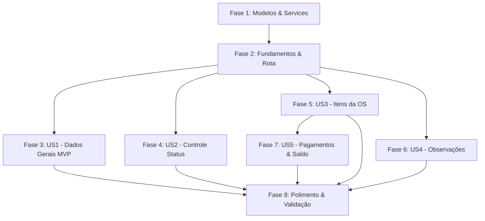

# Tarefas: Página de Detalhe Real da Ordem de Serviço

**Entrada**: Documentos de design em `/specs/010-os-detalhe/`
**Pré-requisitos**: `plan.md`, `spec.md`, `research.md`, `data-model.md`, `contracts/ui.md`, `quickstart.md`
**Organização**: As tarefas estão estruturadas por histórias de usuário e ordenadas por dependência de execução.

## Fase 1: Preparação e Modelos

**Objetivo**: Alinhar tipagens e utilitários de transições de status no modelo da aplicação.

- [X] T001 [P] Atualizar interface `OrdemServico` em `oficina-motos-web/src/app/core/models/ordem-servico.ts` para garantir presença de `veiculoId`, coleções filhas tipadas (`itens`, `observacoes`, `pagamentos`) e tipagem de `UpdateOrdemServicoRequest`
- [X] T002 [P] Atualizar método `update` em `oficina-motos-web/src/app/core/services/ordens.service.ts` para suportar generics de retorno e payload tipado
- [X] T003 [P] Criar constante utilitária de transições válidas de status e mapeamento de severidades de badge em `oficina-motos-web/src/app/core/models/ordem-servico.ts`

## Fase 2: Fundamentos Compartilhados

**Objetivo**: Estruturar o componente standalone `OsDetalheComponent`, rotas e casca da página (T-010.1, T-010.2).

- [X] T004 Criar arquivo de testes unitários base em `oficina-motos-web/src/app/features/ordens-servico/pages/os-detalhe/os-detalhe.spec.ts` com mocks de serviços (`OrdensService`, `ClientesService`, `VeiculosService`, `MecanicosService`, `Toast`)
- [X] T005 Estruturar a classe standalone `OsDetalheComponent` com Signals (`ordem`, `cliente`, `veiculo`, `mecanico`, `loading`, `error`) e `ChangeDetectionStrategy.OnPush` em `oficina-motos-web/src/app/features/ordens-servico/pages/os-detalhe/os-detalhe.ts`
- [X] T006 Garantir o registro da rota `/ordens/:id` no roteador com `loadComponent`, guard `ordensPermissionGuard` (`ordensAction: 'visualizar'`) e parâmetro numérico em `oficina-motos-web/src/app/app.routes.ts`
- [X] T007 Estruturar o template base responsivo com cabeçalho (título, badge de status, botão voltar) e placeholders de seções em `oficina-motos-web/src/app/features/ordens-servico/pages/os-detalhe/os-detalhe.html` e `os-detalhe.scss`

**Marco**: Rota `/ordens/:id` acessível, carregando o componente standalone com tratamento de carregamento e erro.

## Fase 3: História de Usuário 1 — Card "Dados Gerais" com Cliente e Veículo (Prioridade: P1) MVP

**Objetivo**: Exibir o card completo de Dados Gerais com cliente e veículo legíveis (T-010.3).
**Critério de teste independente**: Acessar uma OS válida e confirmar apresentação de ID, cliente com nome/contato, moto com placa/modelo, mecânico e descrição sem IDs crus.

### Testes da História de Usuário 1
- [X] T008 [P] [US1] Criar testes unitários para a resolução assíncrona de cliente e veículo e renderização do card de Dados Gerais em `oficina-motos-web/src/app/features/ordens-servico/pages/os-detalhe/os-detalhe.spec.ts`

### Implementação da História de Usuário 1
- [X] T009 [US1] Implementar métodos de resolução e signals de `cliente` via `ClientesService.get()` e `veiculo` via `VeiculosService.get()` com tratamento gracioso de falha em `oficina-motos-web/src/app/features/ordens-servico/pages/os-detalhe/os-detalhe.ts`
- [X] T010 [US1] Construir o card "Dados Gerais" no template com grid de informações (Cliente com nome/telefone, Veículo com placa/modelo/cor, Mecânico, Datas de abertura/conclusão, Descrição) em `oficina-motos-web/src/app/features/ordens-servico/pages/os-detalhe/os-detalhe.html`
- [X] T011 [US1] Estilizar o card "Dados Gerais" com design responsivo, espaçamento limpo e tipografia consistente em `oficina-motos-web/src/app/features/ordens-servico/pages/os-detalhe/os-detalhe.scss`

## Fase 4: História de Usuário 2 — Controle de Status com Transições Válidas (Prioridade: P1)

**Objetivo**: Controlar o ciclo de vida da OS com dropdown de transições estritamente válidas e atualização via API (T-010.5).
**Critério de teste independente**: Abrir OS nos estados Aberta, EmAndamento, AguardandoPeca e Concluida, confirmando apenas transições permitidas e persistência via API.

### Testes da História de Usuário 2
- [X] T012 [P] [US2] Criar testes unitários para o cálculo de transições válidas e submissão de alteração de status em `oficina-motos-web/src/app/features/ordens-servico/pages/os-detalhe/os-detalhe.spec.ts`

### Implementação da História de Usuário 2
- [X] T013 [US2] Implementar signal computado `transicoesValidas` e método `alterarStatus(novoStatus)` com estado `submittingStatus`, chamada a `OrdensService.update()` e feedback via `Toast` em `oficina-motos-web/src/app/features/ordens-servico/pages/os-detalhe/os-detalhe.ts`
- [X] T014 [US2] Construir no template o seletor de status com badge colorido, dropdown com opções válidas, botão de confirmação (com suporte a alteração imediata/auto-submit) e bloqueio em estados terminais em `oficina-motos-web/src/app/features/ordens-servico/pages/os-detalhe/os-detalhe.html`
- [X] T015 [US2] Estilizar o controle de status e badges visuais por severidade (info, warn, help, success, danger) em `oficina-motos-web/src/app/features/ordens-servico/pages/os-detalhe/os-detalhe.scss`

## Fase 5: História de Usuário 3 — Seção "Itens da OS" (Prioridade: P1)

**Objetivo**: Exibir itens aplicados à OS com quantidades, valores unitários e total geral (T-010.4).
**Critério de teste independente**: Acessar OS com e sem itens, verificando cálculo do somatório e exibição de estado vazio quando não houver peças/serviços.

### Testes da História de Usuário 3
- [X] T016 [P] [US3] Criar testes unitários para a listagem de itens da OS, cálculo de totalizador consolidado e estado vazio em `oficina-motos-web/src/app/features/ordens-servico/pages/os-detalhe/os-detalhe.spec.ts`

### Implementação da História de Usuário 3
- [X] T017 [US3] Implementar signal computado `totalItens` consolidando a soma dos itens em `oficina-motos-web/src/app/features/ordens-servico/pages/os-detalhe/os-detalhe.ts`
- [X] T018 [US3] Construir no template a tabela de itens (descrição, quantidade, valor unitário BRL, subtotal BRL), linha de total geral e mensagem informativa de estado vazio em `oficina-motos-web/src/app/features/ordens-servico/pages/os-detalhe/os-detalhe.html`
- [X] T019 [US3] Estilizar a tabela de itens com alinhamento numérico à direita, bordas sutis e rolagem horizontal mobile em `oficina-motos-web/src/app/features/ordens-servico/pages/os-detalhe/os-detalhe.scss`

## Fase 6: História de Usuário 4 — Seção "Observações" da OS (Prioridade: P2)

**Objetivo**: Exibir histórico de observações da equipe na OS (T-010.6).
**Critério de teste independente**: Acessar OS com e sem observações, confirmando apresentação cronológica e mensagem de estado vazio.

### Testes da História de Usuário 4
- [X] T020 [P] [US4] Criar testes unitários para a renderização de observações da OS e estado vazio em `oficina-motos-web/src/app/features/ordens-servico/pages/os-detalhe/os-detalhe.spec.ts`

### Implementação da História de Usuário 4
- [X] T021 [US4] Construir no template a seção de observações com cards/itens de timeline (texto descritivo, autor e data) e estado vazio quando não houver notas em `oficina-motos-web/src/app/features/ordens-servico/pages/os-detalhe/os-detalhe.html`
- [X] T022 [US4] Estilizar a seção de observações com layout leve e legível em `oficina-motos-web/src/app/features/ordens-servico/pages/os-detalhe/os-detalhe.scss`

## Fase 7: História de Usuário 5 — Seção "Pagamentos" da OS (Prioridade: P2)

**Objetivo**: Exibir lançamentos de pagamento, total pago e saldo pendente (T-010.7).
**Critério de teste independente**: Acessar OS com lançamentos de pagamento e conferir valores, métodos, status e cálculo de saldo pendente.

### Testes da História de Usuário 5
- [X] T023 [P] [US5] Criar testes unitários para a lista de pagamentos, cálculo de total pago, saldo devedor e estado vazio em `oficina-motos-web/src/app/features/ordens-servico/pages/os-detalhe/os-detalhe.spec.ts`

### Implementação da História de Usuário 5
- [X] T024 [US5] Implementar signals computados `totalPago` e `saldoPendente` em `oficina-motos-web/src/app/features/ordens-servico/pages/os-detalhe/os-detalhe.ts`
- [X] T025 [US5] Construir no template a tabela de pagamentos (valor BRL, método, status, data), cards de resumo financeiro (Total Pago, Saldo Pendente) e estado vazio em `oficina-motos-web/src/app/features/ordens-servico/pages/os-detalhe/os-detalhe.html`
- [X] T026 [US5] Estilizar o bloco de pagamentos com badges de status de pagamento e destaque para saldo pendente em `oficina-motos-web/src/app/features/ordens-servico/pages/os-detalhe/os-detalhe.scss`

## Fase 8: Polimento, Tratamento de Erros e Validação

**Objetivo**: Validar a qualidade da tela, tratamento de erros e integridade do build.

- [X] T027 Implementar tratamento resiliente no componente e template para identificador inválido (`NaN` ou `<= 0`) e OS não encontrada (404) com mensagens amigáveis e botão de retorno em `oficina-motos-web/src/app/features/ordens-servico/pages/os-detalhe/os-detalhe.ts` e `os-detalhe.html`
- [X] T028 Executar validação de compilação (`npm run build`) em `oficina-motos-web` e resolver eventuais pendências de tipos ou templates
- [X] T029 Executar testes unitários (`npm test -- --watch=false`) e assegurar aprovação completa dos testes de `OsDetalheComponent`
- [X] T030 Validar os cenários manuais de ponta a ponta descritos em `specs/010-os-detalhe/quickstart.md`
- [X] T031 Atualizar o backlog do projeto em `governance/backlog.md` marcando como concluídas as tasks T-010.1 a T-010.7

## Dependências e Paralelismo

- **Paralelismo em Modelos**: T001, T002 e T003 podem ser executadas em paralelo.
- **Paralelismo em Testes**: Os testes T008, T012, T016, T020 e T023 podem ser elaborados antes das implementações correspondentes de cada história.
- **Independência de Seções**: Após a Fase 2, as seções de Dados Gerais (US1), Controle de Status (US2), Itens (US3) e Observações (US4) podem ser desenvolvidas de forma independente. A seção de Pagamentos (US5) beneficia-se do total de itens calculado em US3 para computar o saldo pendente.

## Estratégia de Entrega (MVP Primeiro)

1. **MVP (Fases 1, 2 e 3)**: A rota `/ordens/:id` carrega a OS real com o Card "Dados Gerais", exibindo cliente, veículo, mecânico e descrição sem IDs brutos.
2. **Ciclo Operacional (Fases 4 e 5)**: Habilitação da alteração de status com transições estritas válidas e exibição da tabela de peças/serviços da OS.
3. **Visão Integral (Fases 6 e 7)**: Adição do histórico de observações internas e quitações financeiras com saldo devedor.
4. **Finalização (Fase 8)**: Verificação de build, aprovação em testes unitários e atualização da governança.
