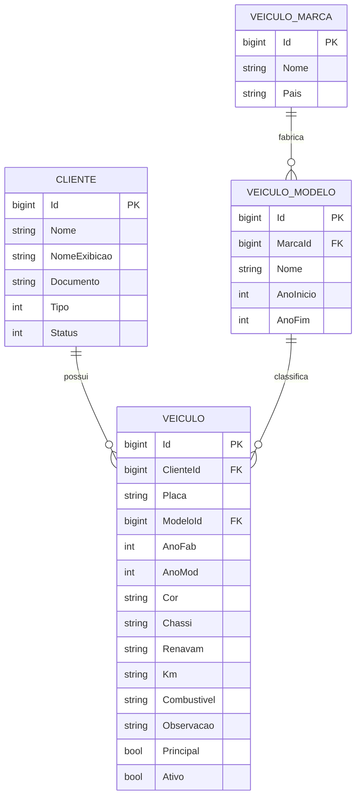

# Modelo de Dados: Cadastro de Veículo (Motocicleta)

## 1. Diagrama de Relacionamento de Entidades



---

## 2. Entidades de Domínio e Tabelas do Banco de Dados

### 2.1 Tabela `vei_veiculos` (Entidade `Veiculo`)

| Coluna | Tipo SQL | Nullable | Descrição / Restrições |
| :--- | :--- | :---: | :--- |
| `Id` | `BIGINT` | Não | Chave primária auto-incremento |
| `ClienteId` | `BIGINT` | Não | FK referenciando `cli_clientes(Id)` |
| `Placa` | `VARCHAR(10)` | Não | Placa do veículo normalizada em maiúsculas |
| `ModeloId` | `BIGINT` | Sim | FK referenciando `vei_modelos(Id)` |
| `AnoFab` | `INT` | Sim | Ano de fabricação (ex.: 2023) |
| `AnoMod` | `INT` | Sim | Ano do modelo (ex.: 2024) |
| `Cor` | `VARCHAR(40)` | Sim | Cor predominante da motocicleta |
| `Chassi` | `VARCHAR(30)` | Sim | Número de identificação do veículo (VIN) |
| `Renavam` | `VARCHAR(20)` | Sim | Código Renavam |
| `Km` | `VARCHAR(20)` | Sim | Quilometragem atual registrada |
| `Combustivel` | `VARCHAR(30)` | Sim | Tipo de combustível (Gasolina, Flex, etc.) |
| `Observacao` | `TEXT` | Sim | Notas gerais sobre a motocicleta |
| `Principal` | `TINYINT(1)` | Não | Define se é a moto principal do cliente (default 0) |
| `Ativo` | `TINYINT(1)` | Não | Status de atividade do registro (default 1) |
| `IsDeleted` | `TINYINT(1)` | Não | Controle de soft delete |
| `CreatedAt` | `DATETIME` | Não | Data/hora de criação do registro |
| `UpdatedAt` | `DATETIME` | Sim | Data/hora da última alteração |

### 2.2 Tabela `vei_marcas` (Entidade `VeiculoMarca`)

| Coluna | Tipo SQL | Nullable | Descrição |
| :--- | :--- | :---: | :--- |
| `Id` | `BIGINT` | Não | Chave primária auto-incremento |
| `Nome` | `VARCHAR(100)` | Não | Nome da montadora (ex.: Honda, Yamaha, BMW) |
| `Pais` | `VARCHAR(60)` | Sim | País de origem |

### 2.3 Tabela `vei_modelos` (Entidade `VeiculoModelo`)

| Coluna | Tipo SQL | Nullable | Descrição |
| :--- | :--- | :---: | :--- |
| `Id` | `BIGINT` | Não | Chave primária auto-incremento |
| `MarcaId` | `BIGINT` | Não | FK referenciando `vei_marcas(Id)` |
| `Nome` | `VARCHAR(100)` | Não | Nome comercial do modelo (ex.: CG 160 Fan) |
| `AnoInicio` | `INT` | Sim | Ano inicial de produção |
| `AnoFim` | `INT` | Sim | Ano final de produção |

---

## 3. Contratos de Dados no Frontend (`veiculo.ts`)

```typescript
export interface CreateVeiculoRequest {
  clienteId: number;
  placa: string;
  modeloId: number | null;
  anoFab: number | null;
  anoMod: number | null;
  cor: string | null;
  chassi: string | null;
  renavam: string | null;
  km: string | null;
  combustivel: string | null;
  observacao: string | null;
  principal: boolean;
  ativo: boolean;
}

export interface Veiculo {
  id: number;
  clienteId: number;
  placa: string;
  modeloId: number | null;
  anoFab: number | null;
  anoMod: number | null;
  cor: string | null;
  chassi: string | null;
  renavam: string | null;
  km: string | null;
  combustivel: string | null;
  observacao: string | null;
  principal: boolean;
  ativo: boolean;
}

export interface VeiculoMarca {
  id: number;
  nome: string;
  pais: string | null;
}

export interface VeiculoModelo {
  id: number;
  marcaId: number;
  nome: string;
  anoInicio: number | null;
  anoFim: number | null;
}
```

---

## 4. Dicionário de Validação do Formulário

| Campo | Validador Angular | Regra de Negócio |
| :--- | :--- | :--- |
| `clienteId` | `Validators.required`, `Validators.min(1)` | Vínculo obrigatório com cliente existente |
| `placa` | `Validators.required`, `placaValidator()` | Padrão Mercosul (`ABC1D23`) ou antigo (`ABC-1234`) |
| `marcaId` | `Validators.required`, `Validators.min(1)` | Seleção obrigatória para habilitar modelo |
| `modeloId` | `Validators.required`, `Validators.min(1)` | Modelo compatível com a marca |
| `anoFab` | `Validators.min(1950)`, `Validators.max(anoCorrente + 1)` | Ano válido de fabricação |
| `anoMod` | `Validators.min(1950)`, `Validators.max(anoCorrente + 2)` | Ano válido do modelo |
| `km` | `Validators.min(0)` | Quilometragem não negativa |
| `chassi` | `Validators.maxLength(17)` | Chassi de até 17 caracteres |
| `cor` | `Validators.maxLength(40)` | Cor de até 40 caracteres |
| `observacao` | `Validators.maxLength(500)` | Observações até 500 caracteres |

