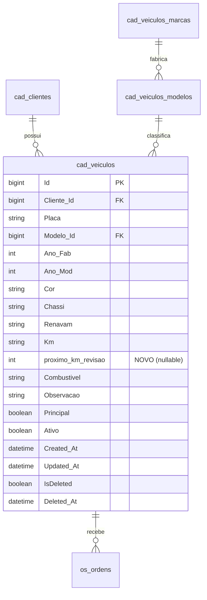

# Modelo de Dados: Campo `proximo_km_revisao`

**Feature**: `014-proximo-km-revisao` | **Data**: 2026-09-13

---

## 1. Diagrama Entidade-Relacionamento (ERD)



---

## 2. Especificação do Campo

| Atributo | Especificação |
|---|---|
| **Nome da Coluna** | `proximo_km_revisao` |
| **Tabela** | `cad_veiculos` |
| **Tipo de Dado SQL** | `INT NULL` (MySQL) |
| **Tipo C#** | `int?` (`System.Nullable<int>`) |
| **Tipo TypeScript** | `number \| null \| undefined` |
| **Mapeamento JSON** | `proximoKmRevisao` (camelCase) |
| **Restrições de Domínio** | Nulo ou `>= 0` |
| **Comportamento Padrão** | `NULL` |
| **Índice Recomendado** | Não obrigatório inicialmente; se futuramente houver relatórios de frotas atrasadas, indexar `(proximo_km_revisao, Km)`. |

---

## 3. Scripts DDL da Migração

### 3.1 Operação `Up`
```sql
ALTER TABLE `cad_veiculos` 
ADD COLUMN `proximo_km_revisao` int NULL;
```

### 3.2 Operação `Down`
```sql
ALTER TABLE `cad_veiculos` 
DROP COLUMN `proximo_km_revisao`;
```

---

## 4. Estruturas em Código

### 4.1 Entidade C# (`OficinaMotos.Domain.Entities.Veiculo`)
```csharp
public class Veiculo : BaseEntity
{
    public long ClienteId { get; set; }
    public string Placa { get; set; } = string.Empty;
    public long? ModeloId { get; set; }
    public int? AnoFab { get; set; }
    public int? AnoMod { get; set; }
    public string? Cor { get; set; }
    public string? Chassi { get; set; }
    public string? Renavam { get; set; }
    public string? Km { get; set; }
    public int? ProximoKmRevisao { get; set; }
    public string? Combustivel { get; set; }
    public string? Observacao { get; set; }
    public bool Principal { get; set; }
    public bool Ativo { get; set; } = true;

    public Cliente? Cliente { get; set; }
    public VeiculoModelo? Modelo { get; set; }
    public ICollection<OrdemServico> OrdensServico { get; set; } = new HashSet<OrdemServico>();
}
```

### 4.2 TypeScript Model (`core/models/veiculo.ts`)
```typescript
export interface Veiculo {
  id: number;
  clienteId: number;
  placa: string;
  modeloId: number | null;
  anoFab: number | null;
  anoMod: number | null;
  cor: string | null;
  chassi: string | null;
  renavam: string | null;
  km: string | null;
  proximoKmRevisao?: number | null;
  combustivel: string | null;
  observacao: string | null;
  principal: boolean;
  ativo: boolean;
}
```

