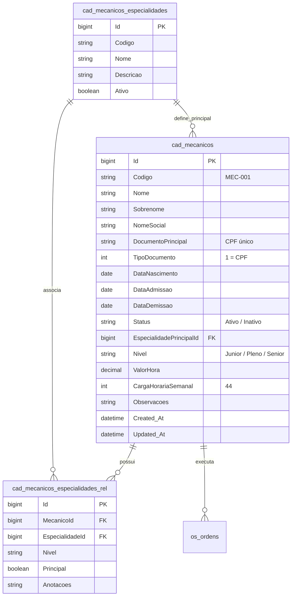

# Modelo de Dados: Cadastro de Mecânico e Especialidades

**Feature**: `015-cadastro-mecanico` | **Data**: 2026-09-13
**Referências de Governança**: [`governance/arquitetura.md`](file:///c:/Projetos/OficinaMotos/governance/arquitetura.md) e [`governance/inventario.md`](file:///c:/Projetos/OficinaMotos/governance/inventario.md)

---

## 1. Diagrama Entidade-Relacionamento (ERD)

---

## 2. Dicionário de Dados do Formulário

| Campo no Formulário | Tipo C# / SQL | Tipo TS | Regras de Validação | Descrição |
|---|---|---|---|---|
| `codigo` | `string` / `varchar(40)` | `string` | Obrigatório, max 40 chars | Código identificador (ex: MEC-001) |
| `nome` | `string` / `varchar(160)` | `string` | Obrigatório, min 2, max 160 | Primeiro nome |
| `sobrenome` | `string?` / `varchar(160)` | `string?` | Opcional, max 160 | Sobrenome do colaborador |
| `nomeSocial` | `string?` / `varchar(160)` | `string?` | Opcional, max 160 | Nome social ou apelido |
| `documentoPrincipal` | `string` / `varchar(40)` | `string` | Obrigatório, CPF válido e único | CPF do profissional |
| `dataNascimento` | `DateTime?` / `date` | `string?` | Opcional | Data de nascimento |
| `dataAdmissao` | `DateTime` / `date` | `string` | Obrigatório | Data de admissão |
| `status` | `string` / `varchar(50)` | `string` | Obrigatório, default 'Ativo' | Situação cadastral |
| `nivel` | `string` / `varchar(50)` | `string` | Obrigatório | Senioridade (Junior/Pleno/Senior/Especialista) |
| `valorHora` | `decimal` / `decimal(10,2)` | `number` | Obrigatório, >= 0 | Valor/hora da mão de obra |
| `cargaHorariaSemanal` | `int` / `int` | `number` | Obrigatório, >= 1, default 44 | Horas semanais |
| `especialidadePrincipalId`| `long?` / `bigint` | `number?` | Opcional | Especialidade de maior proficiência |
| `especialidadesIds` | N/A (Relacionamento N:N) | `number[]` | Pelo menos 0 selecionadas | Especialidades marcadas no multi-select |
| `observacoes` | `string?` / `varchar(500)` | `string?` | Opcional, max 500 chars | Notas adicionais |

